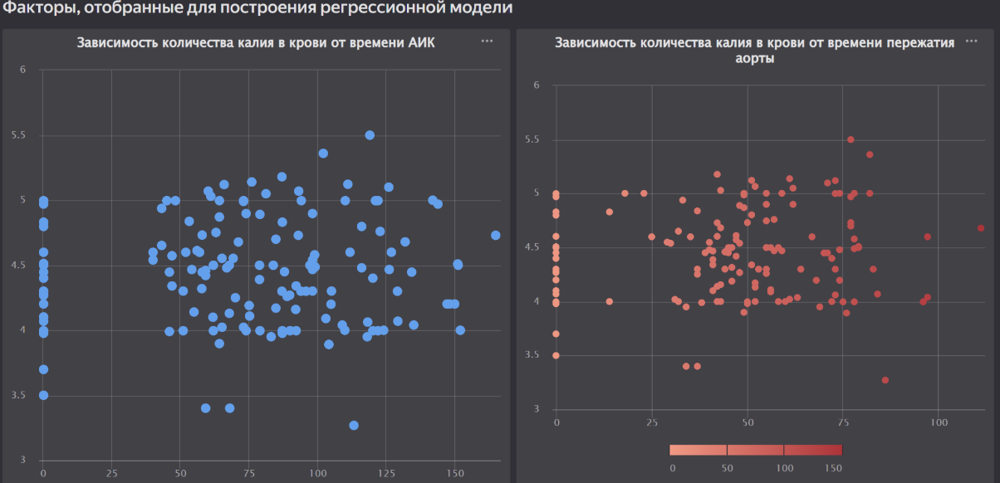
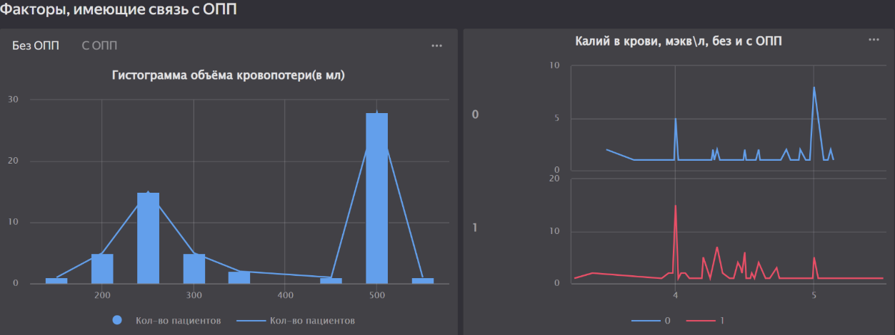

# Анализ данных по пациентам с острым поражением почек (ОПП)

Часто после сложных полостных операций, таких как операции на сердце, у пациентов возникает острое поражение почек (ОПП)
, что является опасным для жизни состоянием. Множество факторов, связанных как с состоянием здоровья пациента, так и с
параметрами операции, влияют на это осложнение. Для диагностики ОПП пациенты проходят наблюдение лечащим врачом в
послеоперационный период, а также проходят анализы крови.

## Данные

В представленных данных о пациентах в формате .csv представлены различные параметры, включая:

- **Развитие ОПП**: наличие острого поражения почек (есть/нет)
- **ХБП стадия**: стадия Хронической Болезни Почек
- **Возраст**: возраст пациента в годах
- **Пол**: м - мужской, ж - женский
- **ГБ**: наличие гипертонической болезни (есть/нет)
- **Сахарный диабет**: наличие сахарного диабета (есть/нет)
- и другие параметры, включая результаты анализов крови и интраоперационные параметры.

## Описание полей

Важные параметры, связанные с прогнозом ОПП и работой почек:

- **Возраст**: чем старше пациент, тем выше риск ОПП
- **Диабет**: наличие сахарного диабета увеличивает риск ОПП
- **ГБ**: наличие гипертонической болезни также увеличивает риск ОПП
- **ХБП**: стадия Хронической Болезни Почек, чем выше стадия, тем хуже
- **Систолическое и диастолическое давление**: высокое давление связано с риском ОПП
- **Частота сердечных сокращений**: высокая частота связана с повышенным риском ОПП
- **PH**: уровень кислотности крови
- **Фракция изгнания**: показатель работы сердца, низкая фракция изгнания связана с риском ОПП
- **Холестерин**: высокий уровень связан с повышенным риском ОПП
- **Креатинин и мочевина**: показатели функции почек, их уровень может указывать на проблемы с почками
- **СКФ**: скорость клубочковой фильтрации, низкий уровень связан с риском ОПП
- **ИМТ**: индекс массы тела, высокий уровень связан с риском ОПП
- **Толщина паренхимы почек**: уменьшение толщины может указывать на проблемы с почками

## Интраоперационные параметры

Длительность операции, работа АИК, время пережатия аорты и другие параметры могут оказывать влияние на риск ОПП, но в
разной степени.

## Важно знать

- Наличие гипертонической болезни, сахарного диабета, старший возраст, высокие показатели кровяного давления, а также
  плохие результаты анализов крови могут служить предикторами возникновения ОПП.
- Внимание к интраоперационным параметрам, таким как работа АИК и время пережатия аорты, также важно для предотвращения
  ОПП.

Эти данные помогают врачам прогнозировать риск ОПП и предпринимать меры для его снижения.

## Первичные исследования

### Инфаркт и длительность операции

- **P-value**: 0.9853
- **Корреляция с использованием ETA**: 0.0015

### Повышенный ИМТ и холестерин

- **Нормальный холестерин**: 77.46%
- **Высокий холестерин**: 22.54%
- **P-value**: 0.4984
- **Корреляция с использованием ETA**: 0.0573
- 

### Толщина паренхимы без ХБП и возраст

- **Проверка корреляции**: -0.1436
- **P-value**: 0.0729

### Процент для групп с хроническими заболеваниями

- **Есть ОПП**: 96.97%
- **Нет ОПП**: 98.28%

### Новый фактор: ИМТ и проблемы с сердцем

Подсчеты показывают, что люди с ИМТ выше нормы более подвержены проблемам с сердцем.

### Недостоверные диагнозы и связи

- В некоторых случаях диагноз ХБП оказался неверным (проверяли по скф_расч).
- Не удалось доказать связь между наличием ИМТ выше нормы и повышенным холестерином, а также связь возраста и толщины
  паренхимы почек у пациентов без ХБП.
- Также не удалось подтвердить связь длительности операции с ранее перенесенным инфарктом.

### Найденные факторы

- В процессе исследования гипотез было найдено несколько факторов, у которых удалось подтвердить наличие связи с развитием ОПП.

## Связи и корреляции

### Связи между факторами развития ОПП

| Фактор 1         | Фактор 2              | Corr. | P-value                                   |
|------------------|-----------------------|-------|-------------------------------------------|
| Длительность АИК | Время пережатия аорты | 0.90  | 6.99e-58 |
| Кол-во шунтов    | Время пережатия аорты | 0.62  | 4.73e-18 |
| Креатинин крови  | Мочевина              | 0.61  | 1.56e-17 |
| Кол-во шунтов    | Длительность операции | 0.59  | 4.59e-16 |
| САД              | ДАД                   | 0.58  | 1.28e-15 |
| СКФ              | ИМТ                   | 0.51  | 5.59e-12 |
| Кол-во шунтов    | Длительность АИК      | 0.51  | 8.61e-12 |

### Немного визуализации

### Таблица количественных факторов, связь с ОПП

| Фактор            | T-statistic | P-value                                 |
|-------------------|-------------|-----------------------------------------|
| Объем инфузий     | 2228.5      | 0.0193 |
| Объем кровопотери | 3447.0      | 0.025  |
| Калий             | 2241.5      | 0.022  |
| ЧСС               | 2283.5      | 0.0327 |

### Таблица категориальных факторов, связь с ОПП

| Фактор        | Chi2   | P-value                               |
|---------------|--------|---------------------------------------|
| кат .ИМТ      | 2.0215 | 0.7318 |
| ХБП           | 1.7872 | 0.4092 |
| ГБ            | 0.9411 | 0.332  |
| Сахарный д.   | 0.9067 | 0.341  |
| АИК и п.крови | 0.0519 | 0.8197 |
| Хрон.Болезни  | 0.0    | 1.0    |

### Связь и корреляции

- Среди наибольших корреляций p-value меньше 0.05, а значит можно сделать вывод, что корреляция является статистически значимой, следовательно это имеет реальный смысл.

## Построенные модели

После построения регрессионной модели успешно получилось найти предположительные данные о калии для пациентов. Среди
наибольших корреляций (см. 3 слайд) P-value меньше 0.05, что говорит о статистической значимости корреляции, и,
следовательно, о реальном значении этой связи.
Модель градиентного бустинга, исходя из метрик, оказалось самой успешной:

- **Точность (Accuracy)**: 78.125%
- **Precision (точность)**:
    - Класс "0" (Отсутствие развития ОПП): 56%
    - Класс "1" (Наличие развития ОПП): 87%
- **Recall (полнота)**:
    - Класс "0": 62%
    - Класс "1": 83%
- **F1-score (F-мера)**:
    - Класс "0": 59%
    - Класс "1": 85%
- **Поддержка (Support)**: 8 для класса "0", 24 для класса "1"

## [Дэшборд](https://datalens.yandex/qeby57za9mquf)

